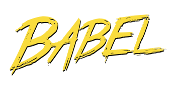
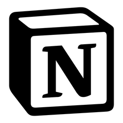

# React Week

## HETIC - H3

Note: transitions none/fade/slide/convex/concave/zoom

---

## Folks

- [Nicolas André](https://twitter.com/nclsndr) — UX Engineer at <a target="_blank" href="https://www.chance.co">Chance</a>
- [Gabriel Vergnaud](https://twitter.com/gabrielvergnaud) — Software Engineer at <a target="_blank" href="https://sketchfab
.com/">Sketchfab</a>

---

## Environment setup

<br>
<p class="text-intro" style="text-align:left;">Make sure <strong>Node</strong> and 
<strong>npm</strong> are installed
 and
  up to	date</p>
<ul style="text-align:left; margin-left:0; width:80%;">
  <li>NodeJS <a target="_blank" href="https://nodejs.org">website</a></li>
  <li>NPM <a target="_blank" href="https://www.npmjs.com/">website</a></li>
</ul>
<br><br>

```bash
$ node -v -> must output >= v10.x
$ npm -v ->  must output >= v6.4
```

---

# React basis
<br>

---

## React
<h3 style="font-weight: normal;">A <strong>JavaScript</strong> library for building <strong>user 
interfaces</strong></h3>

---

## JS vs DOM

```javascript
const divElem = document​.create​Element('div');
divElem.innerText = 'Hello World'
document.appendChild(divElem);
```

[DOM API](https://developer.mozilla.org/en-US/docs/Web/API/Document_Object_Model)

---

<iframe style="height:60vh; width:100vh" src="https://codesandbox.io/embed/domapi-jw61d?fontsize=14" title="dom-api" 
style="width:100%; height:500px; border:0; border-radius: 4px; overflow:hidden;" sandbox="allow-modals allow-forms allow-popups allow-scripts allow-same-origin"></iframe>

---

### Hello JSX

```javascript
const element = <h1>Hello, world!</h1>;
```

[Introducing JSX](https://reactjs.org/docs/introducing-jsx.html)

---

<a target="_blank" href="https://babeljs
.io/repl/#?presets=react&code_lz=DwEwlgbgBAxgNgQwM5IHIILYFMC8AiJACwHsAHUsAOwHMBaOMJAFzwD4AoKKYQgRlYDKJclWpQAMoyZQAZsQBOUAN6l5ZJADpKmLAF9gAej4cuwAK5wTXbg1YBJSswTV5mQ7c7XgtgOqEETEgAguTuYFamtgDyMBZmSGFWhhYchuAQrADc7EA">

</a>

```javascript
// From 
const el = (<div className="shopping-list">
  <h1>Shopping List</h1>
  <ul>
    <li>Instagram</li>
    <li>WhatsApp</li>
    <li>Oculus</li>
  </ul>
</div>
);

// To
React.createElement('div',
  { className: 'shopping-list' },
  React.createElement('h1', null, 'Shopping List'),
  React.createElement('ul', null,
    React.createElement('li', null, 'Instagram'),
    React.createElement('li', null, 'WhatsApp'),
    React.createElement('li', null, 'Oculus')
  )
)

```

---

### Props

```javascript

function WelcomeMessage(props) {
  return <h1>Welcome {props.name}</h1>;
}

function App() {
  return (
    <div>
      <WelcomeMessage name="Sam" />
      <WelcomeMessage name="Julie" />
      <WelcomeMessage name="Thomas" />
    </div>
  );
}
```
---

<iframe style="height:60vh; width:100vh" src="https://codesandbox.io/embed/inspiring-rgb-br9x6?fontsize=14" 
title="introducing-jsx" style="width:100%; height:500px; border:0; border-radius: 4px; overflow:hidden;" sandbox="allow-modals allow-forms allow-popups allow-scripts allow-same-origin"></iframe>

---

## Manage local state

---

### Class component

```javascript

class Counter extends React.Component {
  constructor(props) {
    super(props);
    this.state = { count: 0 };
  }
  onIncrement = () =>
    this.setState(prevState => ({ count: prevState.count + 1 }));
  onDecrement = () =>
    this.setState(prevState => ({ count: prevState.count - 1 }));
  render() {
    const { count } = this.state;
    return (
      <div>
        <button onClick={this.onIncrement}>Increment</button>
        <p>{count}</p>
        <button onClick={this.onDecrement}>Decrement</button>
      </div>
    );
  }
}
```

---

### With hooks

```javascript

const CounterWithHooks = () => {
  const [count, setCount] = React.useState(0)

  return (
    <div>
      <button onClick={() => setCount(p => p + 1)}>Increment</button>
      <button onClick={() => setCount(p => p - 1)}>Decrement</button>
    </div>
  )
}
```

---

<iframe style="height:60vh; width:100vh" src="https://codesandbox.io/embed/xenodochial-clarke-6t17r?fontsize=14" 
title="react-local-state" style="width:100%; height:500px; border:0; border-radius: 4px; overflow:hidden;" sandbox="allow-modals allow-forms allow-popups allow-scripts allow-same-origin"></iframe>

---


<iframe style="height:60vh; width:100vh" src="https://codesandbox
.io/embed/reacth3domtoreact-9jsyq?fontsize=14"
										title="react-h3-dom-to-react" style="width:100%; height:100%; border:0;
									border-radius: 4px; overflow:hidden;" sandbox="allow-modals allow-forms allow-popups allow-scripts allow-same-origin"></iframe>

---

## React ❤️ CSS

---

### raw, SASS, CSS Modules, CSS in JS...
<br><br>

[Create react app Styles docs](https://facebook.github.io/create-react-app/docs/adding-a-stylesheet)

---

<iframe style="height:60vh; width:100vh" src="https://codesandbox.io/embed/upbeat-shape-lupf3?fontsize=14" title="css-in-react" 
style="width:100%; height:500px; border:0; border-radius: 4px; overflow:hidden;" sandbox="allow-modals allow-forms allow-popups allow-scripts allow-same-origin"></iframe>

---

## Static module bundlers

- Webpack — [website](https://webpack.js.org/)
- Parcel — [website](https://parceljs.org/)

---

## An now 🥁

---

## Challenge of the week:

### Code a Notion like app

<a target="_blank" href="https://www.notion.so/product">

</a>

---

---

---

# That's all folks

### Thank you
