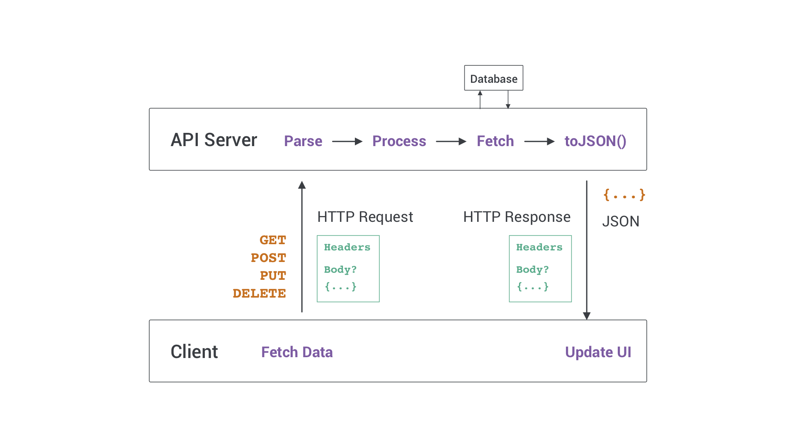
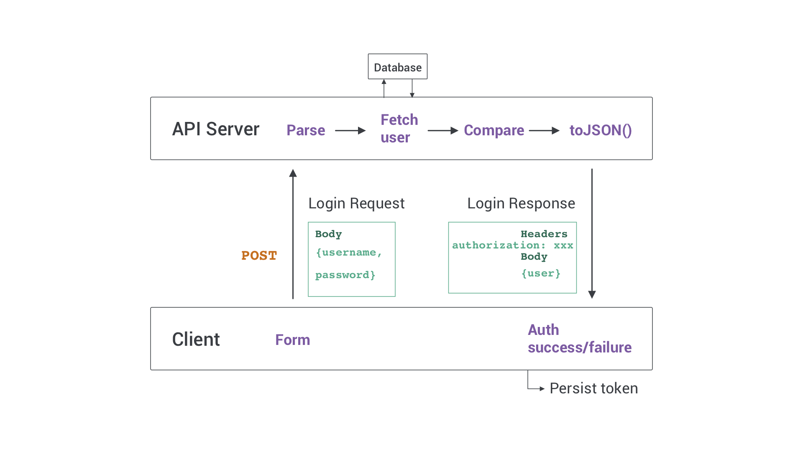

# Semaine React

## HETIC - H3

<a target="_blank" style="font-size: 24px; margin-top: 80px; display: block;" 
   href="https://nclsndr.github.io/react-h3-slides/#/">nclsndr.github
  .io/react-h3-slides</a>

---

## Folks

- [Nicolas André](https://twitter.com/nclsndr) — UX Engineer at <a target="_blank" href="https://www.chance.co">Chance</a>
- [Gabriel Vergnaud](https://twitter.com/gabrielvergnaud) — Frontend Engineer at <a target="_blank" href="https://sketchfab.com/">Sketchfab</a>

---

## Et vous?

Note: technologies, JS level?

---

## Programme de la semaine

<div style="display:flex; flex-direction: column; align-items: flex-start; width: 600px; margin: 0 auto;">
  <p style="font-size: 22px; margin-top: 30px; margin-bottom: 0;">Lundi</p>
  <p style="font-size: 26px; margin: 0; margin-left: 30px; text-align:left;">DOM API, React Basis, 
  local state, DOM refs</p>
  <p style="font-size: 22px; margin-top: 30px; margin-bottom: 0;">Mardi</p>
  <p style="font-size: 26px; margin: 0; margin-left: 30px; text-align:left;">Fonctions pure et side 
  effects, 
  State 
  reducer, 
  useEffect</p>
  <p style="font-size: 22px; margin-top: 30px; margin-bottom: 0;">Mercredi</p>
  <p style="font-size: 26px; margin: 0; margin-left: 30px; text-align:left;">Dealing with network, 
  HTTP, 
  Auth, CSS with React</p>
  <p style="font-size: 22px; margin-top: 30px; margin-bottom: 0;">Jeudi</p>
  <p style="font-size: 26px; margin: 0; margin-left: 30px; text-align:left;">UseRef Advanced, UI 
  animations</p>
  <p style="font-size: 22px; margin-top: 30px; margin-bottom: 0;">Vendredi</p>
  <p style="font-size: 26px; margin: 0; margin-left: 30px; text-align:left;">Functional 
  programming</p>
</div>

---

Organisation des journées

<div style="display: flex; flex-direction: row; margin: auto; width: 600px; justify-content: space-around">
  <div>
    <h3>Matin</h3>
    <p>Cours</p>
  </div>
  <div>
    <h3>Après-midi</h3>
    <p>Projet</p>
  </div>
</div>

---

<h1 style="color: #FFF;">Ready?</h1>

<!-- .slide: data-background="assets/ready.gif" -->

---

# React
<h3 style="font-weight: lighter; text-transform: none;">
A JavaScript library for building user interfaces</h3>
---

## Javascript? 🧐

---

## Javascript

<p style="font-size: 24px; text-align: left; width: 100vh; max-width: 800px; margin: auto;
line-height: 32px;">
  JavaScript, often abbreviated as JS, is a high-level, interpreted programming language that
  conforms to the ECMAScript specification.[...] <br><br>
  Alongside HTML and CSS, JavaScript is one of the core technologies of the World Wide Web. 
  JavaScript enables interactive web pages and is an essential part of web applications. The vast
  majority of websites use it, and major web browsers have a dedicated JavaScript engine to 
  execute it. — <a href="https://en.wikipedia.org/wiki/JavaScript">Wikipedia</a> <br><br>
  Brendan Eich - A Brief History of JavaScript — <a href="https://www.youtube
    .com/watch?v=aX3ZABCdC38">YouTube</a>
</p>

Note: Sun Microsystem / Netscape vs Microsoft

---

## User interface? 🧐

---

## User interface

<p style="font-size: 24px; text-align: left; width: 100vh; max-width: 800px; margin: auto;
line-height: 32px;">
  The user interface (UI), in the industrial design field of human–computer interaction, is the space where interactions between humans and machines occur. — <a href="https://en.wikipedia.org/wiki/User_interfacet">Wikipedia</a>
</p>

---

## 🌍 💻


Ok, mais pourquoi React?

---

<div>
  
</div>

---

<h2 style="color: #FFF;">Defocus — le web</h2>

<!-- .slide: data-background="assets/defocus.gif" -->

---

<!-- .slide: data-background="assets/the-web.jpg" -->

---

### Historiquement

<div>
  
</div>

---

### Avantage

- Pas de logique complexe en front-end

<br>

### Problèmes

- Une seule interaction réseau par chargement
- Requêtes lourdes à traiter coté serveur
- Difficulté d'afficher des interfaces denses

---

<div>
  
</div>

---

### Avantage

- Interfaces riches et fluident
- Charge serveur réduite

<br>

### Problèmes

- Complexité de la logique sur le client front-end

---

<div>
  <h4 style="margin: 0">Twitter 2007</h4>
  
  <a style="font-size: 1rem; display: block;" target="_blank" 
      href="http://web.archive.org/web/20070302084548/http://twitter.com/jack/all_updates">webarchive</a>
</div>

---

<div>
  <h4 style="margin: 0">Twitter 2009</h4>
  
  <a style="font-size: 1rem; display: block;" target="_blank" 
      href="http://web.archive.org/web/20090918000830/https://twitter.com/jack">webarchive</a>
</div>

---

<div>
  <h4 style="margin: 0">Twitter 2011</h4>
  
  <a style="font-size: 1rem; display: block;" target="_blank" 
      href="http://web.archive.org/web/20111212082522/https://twitter.com/jack">webarchive</a>
</div>

---

<div>
  <h4 style="margin: 0">Twitter 2014</h4>
  
  <a style="font-size: 1rem; display: block;" target="_blank" 
      href="http://web.archive.org/web/20141008141738/https://twitter.com/jack">webarchive</a>
</div>

---

<div>
  <h4 style="margin: 0">Twitter 2019</h4>
  
  <a style="font-size: 1rem; display: block;" target="_blank" 
      href="http://web.archive.org/web/20190501220121/https:/twitter.com/jack">webarchive</a>
</div>

---

<h2 style="color: #FFF;">Defocus <br><code>end</code></h2>

<!-- .slide: data-background="assets/focus.gif" -->

---

# Javascript

Fondamentaux

---

## Environment setup

<br>
<p class="text-intro" style="text-align:left;">Make sure <strong>Node</strong> and 
<strong>npm</strong> are installed
 and
  up to	date</p>
<ul style="text-align:left; margin-left:0; width:80%;">
  <li>NodeJS <a target="_blank" href="https://nodejs.org">website</a></li>
  <li>NPM <a target="_blank" href="https://www.npmjs.com/">website</a></li>
</ul>
<br><br>

```bash
$ node -v -> must output >= v10.x
$ npm -v ->  must output >= v6.4
```

---

## JS DOM API

[MDN docs](https://developer.mozilla.org/en-US/docs/Web/API/Document_Object_Model)

---

Create HTML elements

```javascript
const divElem = document​.create​Element('div');
divElem.innerText = 'Hello World'
document.appendChild(divElem);
```

---

Manage events

```javascript
const divElem = document​.getElementById('myButton');
divElem.addEventListener('click', () => {
  // do things...
})
```

---

<iframe style="height:60vh; width:100vh" src="https://codesandbox.io/embed/domapi-jw61d?fontsize=14" title="dom-api" 
style="width:100%; height:500px; border:0; border-radius: 4px; overflow:hidden;" sandbox="allow-modals allow-forms allow-popups allow-scripts allow-same-origin"></iframe>

---

# React basis
<br>
<!-- .slide: data-background="assets/react-bg.jpg" -->

---

## User Interface

### Think in React

---

<div>
  
</div>

---

<div>
  
</div>

---

Abstrait

```javascript
issues
  issue.title
  issue.author
    author.username
    author.avatarUrl
  issue.comments.count
```

---

Concret

```html
<div class="issue">
  <div class="left">
    <span class="icon icon_status">
  </div>
  <div class="center">
    <h4 class="title">Issue title</h4>
    <p class="info">#IssueNumber dateFrom authorName</p>
  </div>
  <div class="right">
    <button class="commentCount">#Comments</button>
  </div>
</div>
```

---

Soit, pour la liste

```html
<div class="issues">
  <div class="issue"><!-- ... --></div>  
  <div class="issue"><!-- ... --></div>  
  <div class="issue"><!-- ... --></div>  
  <div class="issue"><!-- ... --></div>  
</div>
```

---

## Hello JSX

```javascript
const element = <h1>Hello, world!</h1>;
```

[Introducing JSX](https://reactjs.org/docs/introducing-jsx.html)

---

<a target="_blank" href="https://babeljs
.io/repl/#?presets=react&code_lz=DwEwlgbgBAxgNgQwM5IHIILYFMC8AiJACwHsAHUsAOwHMBaOMJAFzwD4AoKKYQgRlYDKJclWpQAMoyZQAZsQBOUAN6l5ZJADpKmLAF9gAej4cuwAK5wTXbg1YBJSswTV5mQ7c7XgtgOqEETEgAguTuYFamtgDyMBZmSGFWhhYchuAQrADc7EA">

</a>

```javascript
// From 
const el = (
<div className="user">
  <p>Tom</p>
</div>)

// To
React.createElement("div", {
  className: "user"
}, React.createElement("p", null, "Tom"));

```

---

## React Components

---

Un component React est avant tout une fonction

```javascript
const Issue = () => (
  <div className="issue">
    <!-- ... -->
  </div>
)
```

---

#### Et les classes alors?

<p style="font-size: 24px">(on y revient)</p>

---

### Props

Les props permettent de connecter un composant parent à ses enfants

<br>

1. par la transmission de données parent > enfant
2. et par le passage de références de fonctions callback 

---

La valeur de title est portée par `props.title`

```javascript
const Issue = (props) => {
  return (
    <div className="issue">
      <!-- ... -->
        <h4 className="title">{props.title}</h4>
     <!-- ... -->
    </div>
  );
}
const App = () => (
  <div>
    <Issue title="Issue title" />
  </div>
)
```
---

La fonction de callback `onClick` est héritée de `App`

```javascript
const Issue = (props) => {
  return (
    <div className="issue" onClick={props.onRowClick}>
      <!-- ... -->
    </div>
  );
}
const App = () => {
  const handleClick = e => { /* do things */ }
  return (
    <div>
        <Issue onRowClick={handleClick} />
      </div>
  )
}
```

---

### Data Flow

En react le data flow est unidirectionnel

composant parent → composants enfants

data down, events up

---

<iframe style="height:60vh; width:100vh" src="https://codesandbox.io/embed/inspiring-rgb-br9x6?fontsize=14" 
title="introducing-jsx" style="width:100%; height:500px; border:0; border-radius: 4px; overflow:hidden;" sandbox="allow-modals allow-forms allow-popups allow-scripts allow-same-origin"></iframe>

---

## 🤷‍♀️

Ok, mais je fais comment pour update une valeur?

---

## Local state

---


Chaque composant peut contenir un **state**

---

### le state

La **data** définit l'interface

Quand le state **update**, l'interface **update**

---

<div style="display: flex; flex-direction: row; justify-content: space-around;">
  
  
</div>

---

`view = f(state)`

plus besoin d'update la view.

Il suffit d'update le state

---

<iframe style="height:60vh; width:100vh" src="https://codesandbox.io/embed/xenodochial-clarke-6t17r?fontsize=14" 
title="react-local-state" style="width:100%; height:500px; border:0; border-radius: 4px; overflow:hidden;" sandbox="allow-modals allow-forms allow-popups allow-scripts allow-same-origin"></iframe>

---

### Classe

```javascript

class Counter extends React.Component {
  constructor(props) {
    super(props);
    this.state = { count: 0 };
  }
  onIncrement = () =>
    this.setState(prevState => ({ count: prevState.count + 1 }));
  onDecrement = () =>
    this.setState(prevState => ({ count: prevState.count - 1 }));
  render() {
    const { count } = this.state;
    return (
      <div>
        <button onClick={this.onIncrement}>Increment</button>
        <p>{count}</p>
        <button onClick={this.onDecrement}>Decrement</button>
      </div>
    );
  }
}
```

---

### `UseState` hook

```javascript

const CounterWithHooks = () => {
  const [count, setCount] = React.useState(0)

  return (
    <div>
      <button onClick={() => setCount(p => p + 1)}>Increment</button>
      <button onClick={() => setCount(p => p - 1)}>Decrement</button>
    </div>
  )
}
```

---

<iframe style="height:60vh; width:100vh" src="https://codesandbox
.io/embed/reacth3domtoreact-9jsyq?fontsize=14"
										title="react-h3-dom-to-react" style="width:100%; height:100%; border:0;
									border-radius: 4px; overflow:hidden;" sandbox="allow-modals allow-forms allow-popups allow-scripts allow-same-origin"></iframe>

---

## An now 🥁

---

## Challenge of the week:

### Code a Notion like app

<a target="_blank" href="https://www.notion.so/product">

</a>

---

<iframe style="height:60vh; width:100vh" src="https://codesandbox.io/embed/notionv2withstudents-oijfx?fontsize=14" 
title="notion-v2-with-students" style="width:100%; height:500px; border:0; border-radius: 4px; overflow:hidden;" sandbox="allow-modals allow-forms allow-popups allow-scripts allow-same-origin"></iframe>

---

# ⏱

---

# Semaine React

## HETIC - H3

<a target="_blank" style="font-size: 24px; margin-top: 80px; display: block;" 
   href="https://nclsndr.github.io/react-h3-slides/#/62">nclsndr.github
  .io/react-h3-slides</a>

---

# 📡 🌍

## Dealing with the network

---

## HTTP

HyperText Transfer Protocol

Note: wiki —
HTTP a été inventé par Tim Berners-Lee avec les adresses Web et le langage HTML pour créer le World Wide Web. À cette époque, le File Transfer Protocol (FTP) était déjà disponible pour transférer des fichiers, mais il ne supportait pas la notion de format de données telle qu'introduite par Multipurpose Internet Mail Extensions (MIME). La première version de HTTP était très élémentaire, mais prévoyait déjà le support d'en-têtes MIME pour décrire les données transmises. Cette première version reste encore partiellement utilisable de nos jours, connue sous le nom de HTTP/0.9.

En mai 1996, HTTP/1.0 voit le jour et est décrit dans la RFC 19451. Cette version supporte les serveurs HTTP virtuels, la gestion de cache et l'identification.

En janvier 1997, HTTP/1.1 devient finalement standard de l'IETF. Il est décrit dans la RFC 20682 de l'IETF, puis dans la RFC 26163 en juin 1999. Cette version ajoute le support du transfert en pipeline (ou pipelinage) et la négociation de type de contenu (format de données, langue).

En mars 2012, les travaux à propos de HTTP/2.0 démarrent à l'IETF adoptant SPDY comme matériel de départ.

En février 2014, la spécification de HTTP 1.1 a été republiée. Elle a été éclatée en plusieurs RFC et corrigée pour toutes ses imprécisions, RFC 72304 à RFC 72375.

---

On a vu précédemment

<div>
  
</div>

---

En regardant de plus près: Client <> API

<div>
  
</div>

---

### 1. Verbs

```bash
 HEAD
 OPTIONS
 ---
 GET
 POST
 PUT
 PATCH
 DELETE
 ---
 TRACE
 CONNECT
```

Note: Who can tell which do what?

---

### 2. Headers

<br>

Transport de meta-données sur la couche HTTP

Représentés sous la forme

`key<string>: value<string>`

---

### Content-Type

```bash
  Content-Type: application/json
```

Indique le type de contenu échangé

<a target="_blank" style="display: block;font-size: .8em;margin: 30px 0;" href="https://developer
.mozilla.org/en-US/docs/Web/HTTP/Basics_of_HTTP/MIME_types/Complete_list_of_MIME_types">
Docs</a>

---

### CORS

<p style="font-size: .6em;">Cross-Origin Resource Sharing</p>

```bash
  Access-Control-Allow-Origin: * ??
```

En XHR, le serveur doit valider la provenance du client

<a target="_blank" style="display: block;font-size: .8em;margin: 30px 0;" href="https://developer.mozilla.org/en-US/docs/Web/HTTP/CORS">
Docs</a>

---

### Preflight request
 
 ```bash
   OPTIONS /resource
      Access-Control-Allow-Origin
      Access-Control-Request-Method
      Access-Control-Request-Headers
 ```

Permet au client de s'assurer de l'authorisation serveur

(sur requêtes CORS uniquement)

<a target="_blank" style="display: block;font-size: .8em;margin: 30px 0;" href="https://developer.mozilla.org/en-US/docs/Glossary/Preflight_request">
Docs</a>

---

### Authorization

```bash
  Authorization: reqToken
```

Transporte le token d'authentification

<a target="_blank" style="display: block;font-size: .8em;margin: 30px 0;" href="https://developer.mozilla.org/en-US/docs/Web/HTTP/Headers/Authorization">
Docs</a>

---

Request headers (exemple)

```bash
Accept: application/json
Content-Type: application/json
Authorization: [Token]
Origin: https://my-api.com
Referer: https://any/users/4
User-Agent: Mozilla/5.0 (Macintosh; Intel Mac OS X 10)...
```

---

Response headers (exemple)

```bash
Access-Control-Allow-Origin: https://my-api.com
Access-Control-Expose-Headers: Authorization
Authorization: [Token]
Connection: keep-alive
Content-Length: 374
Content-Type: application/json; charset=utf-8
Date: Tue, 03 Jun 2019 18:44:36 GMT
```

---

# 👨‍🔧

## Data Architectures

---

### REST

```bash
  GET — Lire
  POST — Créer
  PUT/PATCH — Update
  DELETE — Supprimer
```

<a target="_blank" style="display: block;font-size: .8em;margin: 30px 0;" href="https://hackernoon.com/restful-api-design-step-by-step-guide-2f2c9f9fcdbf">
Article</a>

---

### GraphQL

```graphql
  type Query {
    me: User
  }
  
  type User {
    id: ID
    name: String
  }
```

<a target="_blank" style="display: block;font-size: .8em;margin: 30px 0;" href="https://graphql.org/learn/">
Docs</a>

---

<iframe style="height:30vh; width:100vh" src="https://codesandbox
.io/embed/fetchdata-8b9g9?fontsize=14" title="fetch-data" 
allow="geolocation; microphone; camera; midi; vr; accelerometer; gyroscope; payment; ambient-light-sensor; encrypted-media" style="width:100%; height:500px; border:0; border-radius: 4px; overflow:hidden;" sandbox="allow-modals allow-forms allow-popups allow-scripts allow-same-origin"></iframe>

<iframe style="height:30vh; width:100vh" src="https://codesandbox
.io/embed/nodesandbox-ixpxl?expanddevtools=1&fontsize=14&view
=preview" title="react-h3-backend-sandbox" allow="geolocation; microphone; camera; midi; vr; accelerometer; gyroscope; payment; ambient-light-sensor; encrypted-media" style="width:100%; height:500px; border:0; border-radius: 4px; overflow:hidden;" sandbox="allow-modals allow-forms allow-popups allow-scripts allow-same-origin"></iframe>

---

# 🔒 ⚙️

## Authentication flow

---

<div>
  
</div>

---

# 🧐️

## JWT?

---

<iframe style="height:30vh; width:100vh" src="https://codesandbox
.io/embed/fetchdata-8b9g9?fontsize=14" title="fetch-data" 
allow="geolocation; microphone; camera; midi; vr; accelerometer; gyroscope; payment; ambient-light-sensor; encrypted-media" style="width:100%; height:500px; border:0; border-radius: 4px; overflow:hidden;" sandbox="allow-modals allow-forms allow-popups allow-scripts allow-same-origin"></iframe>

<iframe style="height:30vh; width:100vh" src="https://codesandbox
.io/embed/nodesandbox-ixpxl?expanddevtools=1&fontsize=14&view
=preview" title="react-h3-backend-sandbox" allow="geolocation; microphone; camera; midi; vr; accelerometer; gyroscope; payment; ambient-light-sensor; encrypted-media" style="width:100%; height:500px; border:0; border-radius: 4px; overflow:hidden;" sandbox="allow-modals allow-forms allow-popups allow-scripts allow-same-origin"></iframe>

---

# React ❤️ CSS

---

### raw, SASS, CSS Modules, CSS in JS...
<br><br>

[Create react app Styles docs](https://facebook.github.io/create-react-app/docs/adding-a-stylesheet)

---

<iframe style="height:60vh; width:100vh" src="https://codesandbox.io/embed/upbeat-shape-lupf3?fontsize=14" title="css-in-react" 
style="width:100%; height:500px; border:0; border-radius: 4px; overflow:hidden;" sandbox="allow-modals allow-forms allow-popups allow-scripts allow-same-origin"></iframe>

---

## Static module bundlers

- Webpack — [website](https://webpack.js.org/)
- Parcel — [website](https://parceljs.org/)

---

## 🎁

### GIPHY browser

---

<iframe style="height:60vh; width:100vh" src="https://codesandbox
.io/embed/beautiful-wescoff-hvb66?fontsize=14" title="react-h3-giphy" allow="geolocation; microphone; camera; midi; vr; accelerometer; gyroscope; payment; ambient-light-sensor; encrypted-media" style="width:100%; height:500px; border:0; border-radius: 4px; overflow:hidden;" sandbox="allow-modals allow-forms allow-popups allow-scripts allow-same-origin"></iframe>

---

<style>
 .reveal pre {
    border-radius: 5px;
    box-shadow: 0px 8px 25px rgba(0,0,0,.25);
  }

  .reveal section img {
    border: none;
      box-shadow: 0 5px 15px rgba(0, 0, 0, 0.15)
  }

  .reveal pre code {
    padding: 30px;
    border-radius: 5px;
    font-weight: normal;
  }

  .reveal code {
    font-weight: bold;
  }
</style>